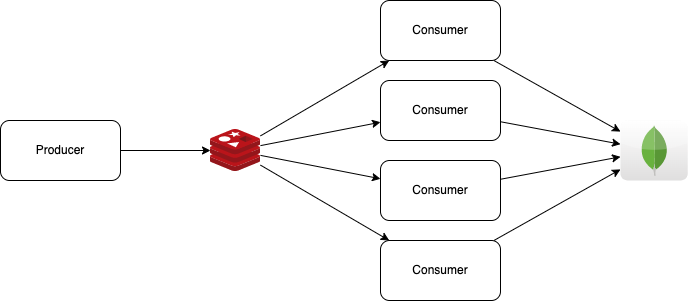

# Test Redis Queue

Test using Redis queue with bull library to make sure one message is only consumed by one consumer at the one time.

## Prerequisite

- Docker
- NodeJS

## Testing Strategy

- Producer produce message to Redis, each message contain unique content data.
- Start multi consumers listen to the Redis in the same queue.
- Consumers will write the content to MongoDB.
- After finish, check is there any duplicated content data in MongoDB.

Flow of producer and consumer



## Run

Run Redis and MongoDB

```
docker compose up
```

Open another terminal and run

```
node index.js
```

The expected output:

```
==> Data is cleared
2022-10-02T14:30:54.476Z producer Redis connected
2022-10-02T14:30:54.706Z producer Total messages sent: 100
2022-10-02T14:30:54.830Z producer Total messages sent: 200
2022-10-02T14:30:54.951Z producer Total messages sent: 300
...
...
2022-10-02T14:31:10.005Z producer Total messages sent: 9800
2022-10-02T14:31:10.141Z producer Total messages sent: 9900
2022-10-02T14:31:10.278Z producer Total messages sent: 10000
Producer exited. Wait 5 seconds for consumers process all messages
Consumers exited. Start verifier
2022-10-02T14:31:15.587Z verifier Database connected
==> Total records 10000
==> Aggregate duplicated result []
==> No duplicated
```
